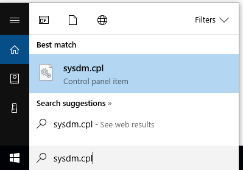
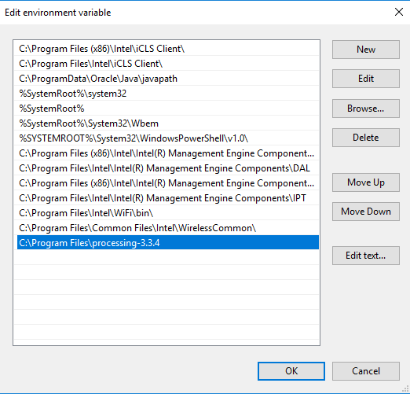

Installing and configuring Sublime on your home Windows computer
=============================

To use Sublime at home, you will need to install several different programs and configure the Windows path variable.

Install Processing
------------------
1. Download [Processing](https://processing.org/download/?processing). On the school computers we are using the 64 bit version of Processing 3
2. Extract the compressed folder. It will be named something like `processing-2.2.1-windows64.zip`. One way is to right click on the folder and choose *Extract All*
3. The extracted folder will have a name like `processing-2.2.1`. Move the folder to a convienant location. One place might be `C:\Program Files`.

Install GitBash
---------------
1. Go to [https://git-scm.com/downloads](https://git-scm.com/downloads) and click on *Windows* under *Downloads*.
2. Double click the downloaded file. It will have a name like `Git-1.9.4-preview20140815.exe`.
3. Click *Run*
4. The default configuration works fine, you can click *Yes* or *Next* whenever prompted

Install Sublime Text 3
---------------
1. Go to [http://www.sublimetext.com/3](http://www.sublimetext.com/3) and download Sublime Text 3 for Windows. 
2. Double click the downloaded file. It will have a name like `Sublime Text Build 3083 x64 Setup.exe`.
3. Click *Run*
4. The default configuration works fine, you can click *Yes* or *Next* whenever prompted

Install Package Control for Sublime
---------------
1. Start Sublime
2. Choose *View | Show Console*  

3. Open a browser, and go to [https://packagecontrol.io/installation](https://packagecontrol.io/installation) (The Sublime Package Control Installation page)
4. Copy the code that sarts with `import urllib.request`
5. Paste that in the console in Sublime and press enter

6. In Sublime, check to see if there is a *Package Control* under *Preferences*

Configure the Windows path variable
---------------
1. Click on the start menu
2. In the field labeled *Search programs and files* type `sysdm.cpl` and press enter  

3. In the *System Properties* window, click on the *Advanced* tab
4. Click on the *Environment Variables* button
5. Under *System Variables* scroll down and choose *Path.* Then click on *Edit*  

6. At the very end of the *Variable Value* field type a semi-colon and then type the path to Processing. It should look like `;C:\Program Files\processing-2.2.1`  
7. Click on *Ok* and *Ok* to exit

Install the Processing plugin for Sublime
---------------
1. In Sublime, choose *Preferences | Package Control*
2. Click on *Package Control: Install Package"
3. Type *Processing* in the text field
4. Click on *Processing* to install the plugin
5. Look at the bottom left of the Sublime program to see if the plugin installed correctly

Configure the Processing plugin for Sublime
---------------
1. In Sublime choose *Tools | Build System | Processing*
2. Choose *Tools | Build With...* and click on Processing
3. Choose *View | Syntax | Processing*

